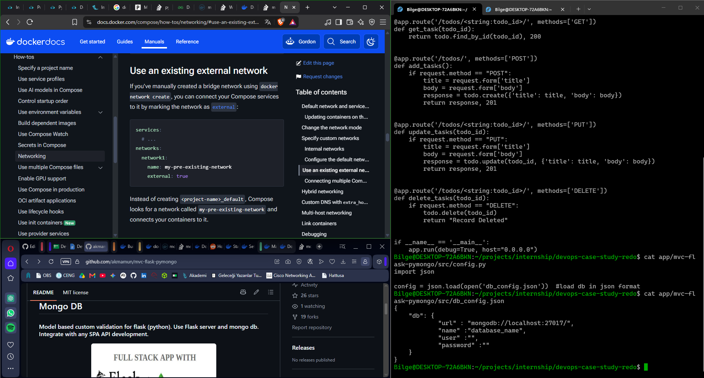

   # Case-Study Report
   *This is a report kept of the*
   *project* **case study**. *Because of my unsatisfactory*
   *work on the previous case, this will be well documented*
   *and explained step by step through.*
  
   ---
  
   | Time  | Actions Taken |
   | ----- | ----------------------- | 
   | 25.09 |  - New git repo initialized| 
   | | -  Decided to use python project. |
   | | - Understood what the project is and how to work with it |
   | | - Started with creating a Dockerfile | 
   | | - Problems with the flask server |
   | 26.09 | - Decided that maybe the problem is that flask is looking for the db to work |
   | | - Created a compose file using docker hub's mongo:7.0.43-jammy |
   | | - Both services work, seem to communicate but still 404 error despite requests going through |
   | | - Tons of research on docker, flask, mongodb |
   | | -   | 
   | | - Decided its not a networking issue, putting a pin on it for later |
   | | - Refreshing k8s knowledge by going through some of the courses again |
   | | - Decided to use minikube with this project as well | 
   | 27.09 | - Getting started with raw k8s manifests |
---
   ### Ideas / Problems / Missing Parts 
*This part of the report is for keeping track of pins i've decided*
*to solve later.*

1- 404 not found problem with flask 
2- Security issues on dockerfile and compose
